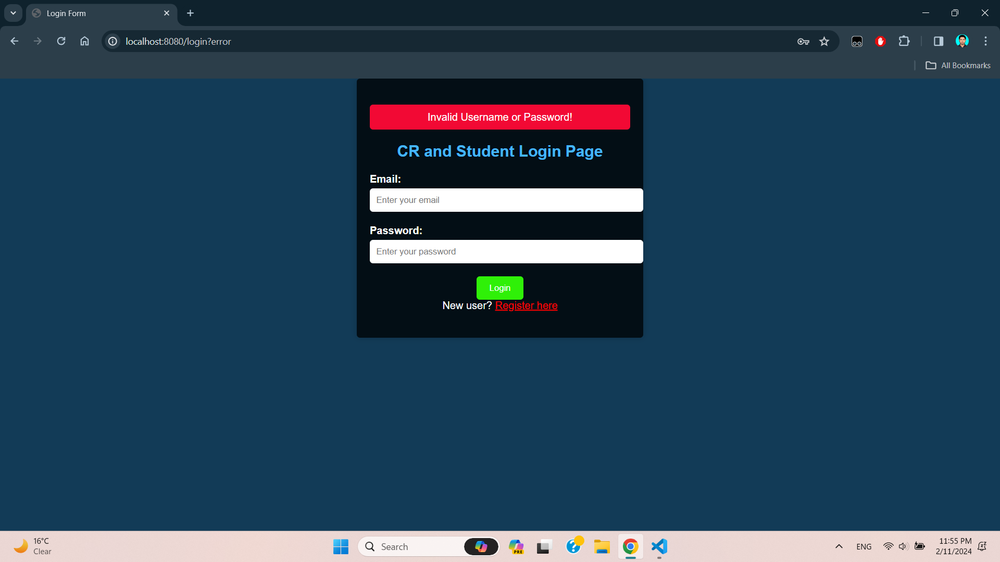
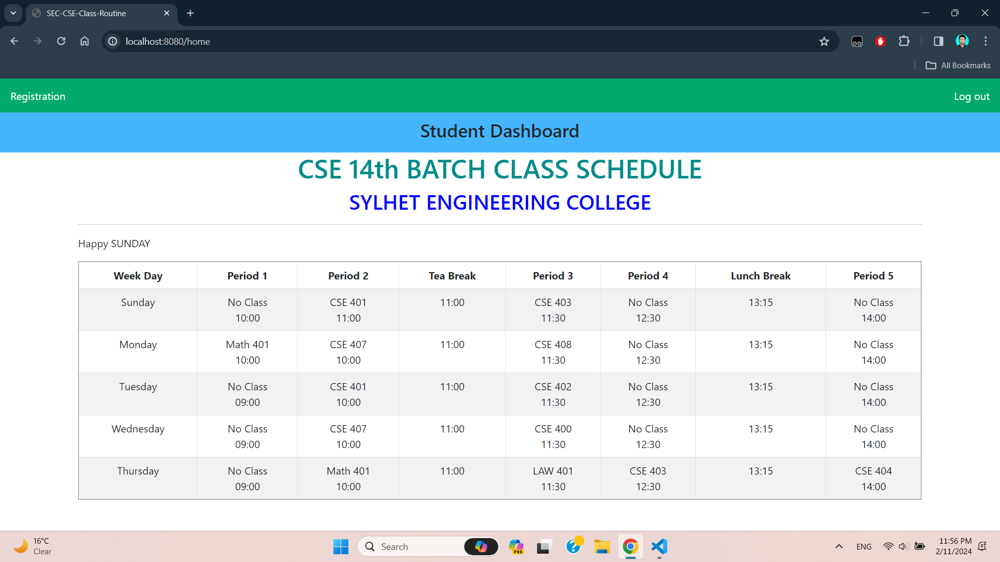
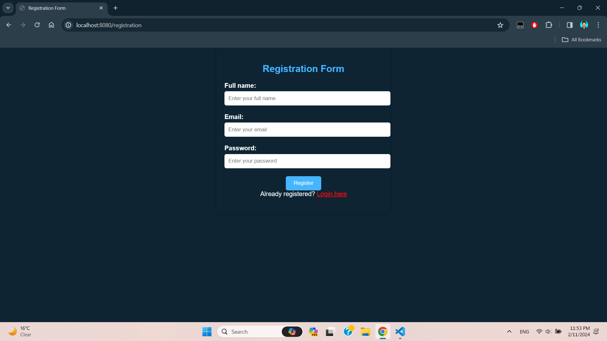
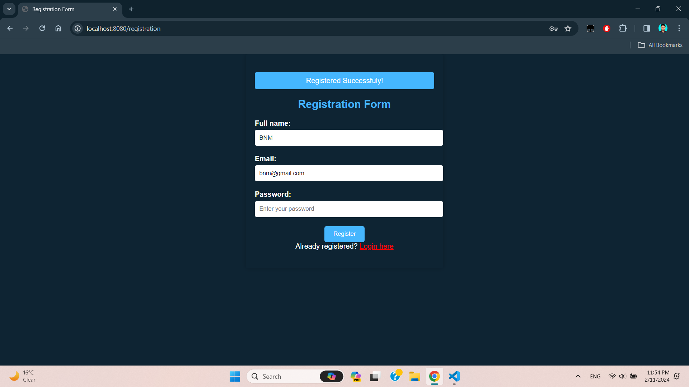
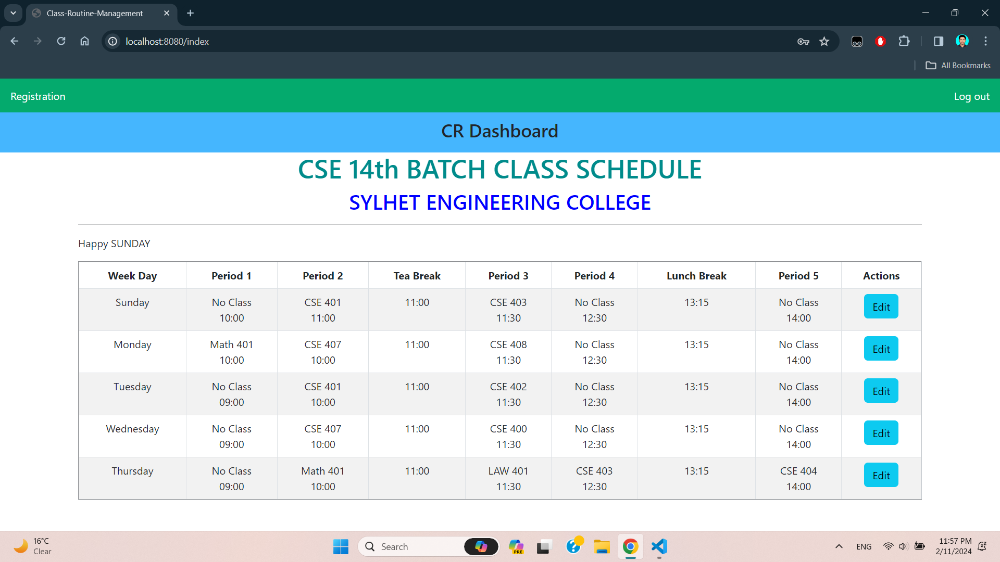
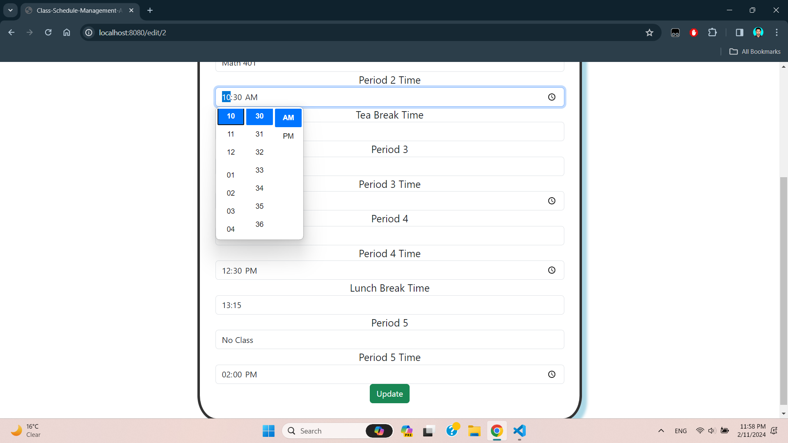
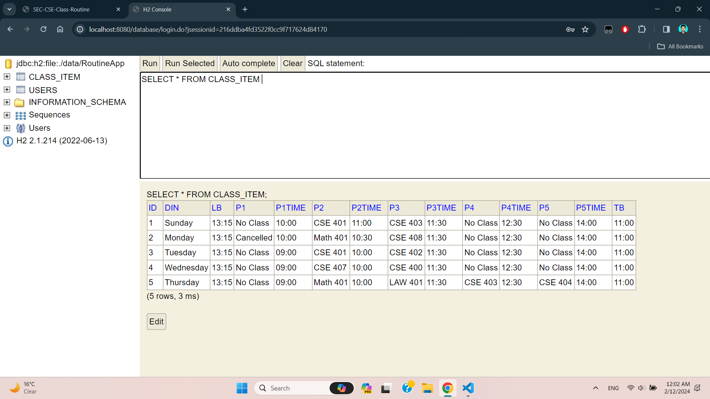
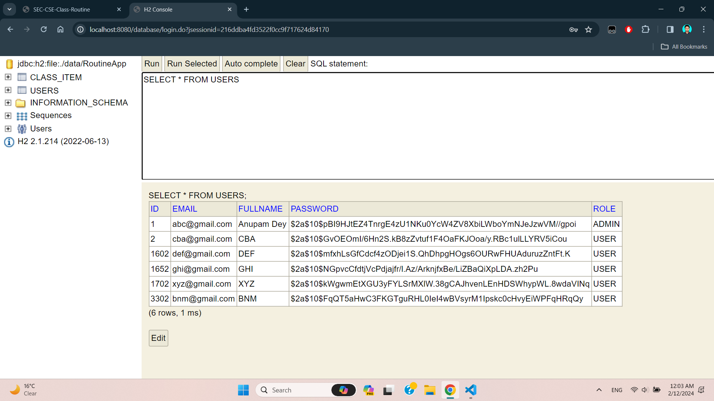

# Class Schedule Management System

## 📌 Project Overview
The **Class Schedule Management System** is a Spring Boot-based web application developed to organize and track academic routines for the CSE 14th Batch at Sylhet Engineering College. It provides a centralized dashboard to view daily class periods, tea breaks, and lunch intervals, with administrative capabilities to update the schedule in real-time.

## 🚀 Features
- **Dynamic Dashboard**: Displays the weekly routine with period-specific timings.
- **Real-time Date Recognition**: Automatically identifies and displays the current day of the week.
- **CRUD Operations**: Edit and update routine items through a dedicated web interface.
- **Persistent Storage**: Utilizes an H2 file-based database for data persistence.
- **Responsive UI**: Built with Bootstrap 5 to ensure accessibility across different devices.

## 🛠️ Tech Stack
- **Backend**: Java 17, Spring Boot 3.1.4
- **Frontend**: Thymeleaf, HTML5, Bootstrap 5, jQuery
- **Database**: H2 Database (File-based)
- **Build Tool**: Maven
- **Libraries**: Project Lombok, Spring Data JPA

## Project Demonstration
**1. User Authentication, Access Control and Registration**
<p align="center">
  
  <br> <i>Figure 1: Admin and User Login page with message for entering wrong username or password.</i>
</p>

<p align="center">
  
  <br> <i>Figure 2: A student logs into the website to see his class sechedule.</i>
</p>

<p align="center">
  
  <br> <i>Figure 3: Registration Form.</i>
</p>

<p align="center">
  
  <br> <i>Figure 4: Sample Registration.</i>
</p>

**2. Admin Making Real-time Updates**
<p align="center">
  
  <br> <i>Figure 5: Admin Dashboard. Admin need to click the "Edit" button to make updates to the schedule.</i>
</p>

<p align="center">
  
  <br> <i>Figure 6: Admin making updates to the time of the 2nd period of Monday. He can also edit the subject name. Updated time and subject name will be shown on both Student and Admin Dashboard.</i>
</p>

**3. Database Schema**
<p align="center">
  
  <br> <i>Figure 7: Class Schedule Database.</i>
</p>

<p align="center">
  
  <br> <i>Figure 8: User Database.</i>
</p>


## 📂 Project Structure
- `src/main/java`: Contains the Spring Boot application logic, including controllers, entities, and repositories.
- `src/main/resources/templates`: Contains Thymeleaf HTML templates for the UI.
- `data/`: Directory where the H2 database files are stored.

## ⚙️ Installation & Usage

### Prerequisites
- Java 17 or higher
- Maven 3.6+

### Steps
1. **Clone the repository**:
   ```bash
   git clone https://github.com/anupam-sec/class-schedule-management.git
   ```
2. **Navigate to the project directory**:
   ```bash
   cd Class-Schedule-Management
   ```
3. **Run the application**:
   ```bash
   ./mvnw spring-boot:run
   ```
4. **Access the application**:
   Web UI:
   ```bash
   http://localhost:8080/
   ```
   H2 Console:
   ```bash
   http://localhost:8080/h2-db (Credentials: admin/password)
   ```
